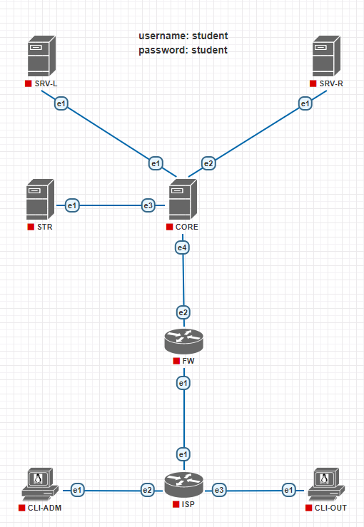
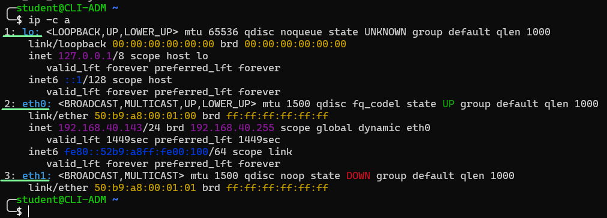
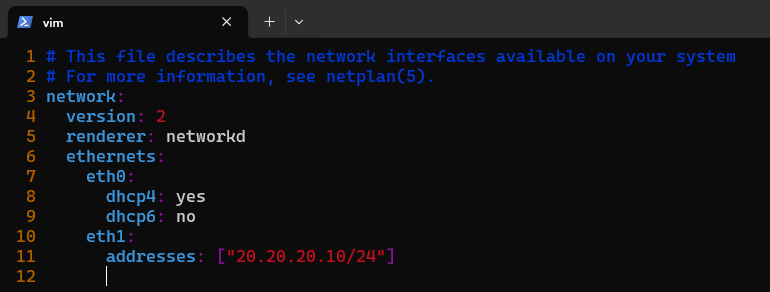
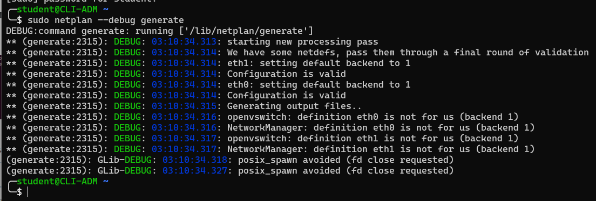

# Лабораторная работа №1

Ссылка на образ: [pnetlab](https://sfedu-my.sharepoint.com/:u:/g/personal/bobryshev_sfedu_ru/EX5-SMMa2gdFpoDE5mwZCw0BEVTXpBBeoEr74rFXtwiKsw?e=SakZtj)

Импортировать образ необходимо в VMWare

Для корректной работы следует установить [Windows Client Side](https://www.eve-ng.net/index.php/download/#:~:text=Workstation%20Player%20(free)-,Windows%20Client%20Side,-Below%20one%20can)

# Конфигурация хостов и маршрутизация

### Описание топологии

| Сеть  | Хосты | IPv6 | IPv4 |
| --- | --- | --- | --- |
| SRV | CORE | 2002:db:a::1/64 | No |
| SRV | SRV-L | 2002:db:a::10/64 | No |
| SRV | SRV-R | 2002:db:a::20/64 | No |
| ——————————— | ——————————— | ——————————— | ——————————— |
| STR | CORE | 2002:db:b::1/64 | No |
| STR | STR | 2002:db:b::10/64 | No |
| ——————————— | ——————————— | ——————————— | ——————————— |
| INT | CORE | 2002:db:c::1/64 | 40.40.40.10/24 |
| INT | FW | 2002:db:c::10/64 | 40.40.40.1/24 |
| ——————————— | ——————————— | ——————————— | ——————————— |
| EXT | ISP | No | 10.10.10.1/24 |
| EXT | FW | No | 10.10.10.10/24 |
| ——————————— | ——————————— | ——————————— | ——————————— |
| ADM | ISP | No | 20.20.20.1/24 |
| ADM | CLI-ADM | No | 20.20.20.10/24 |
| ——————————— | ——————————— | ——————————— | ——————————— |
| OUT | ISP | No | 30.30.30.1/24 |
| OUT | CLI-OUT | No | 30.30.30.10/24 |

---



---

### Задание 1. Конфигурация хостов

Для настройки на каждой машине используется учетная запись

```bash
username: student
password: student
```

---

************************************Настройка hostname************************************

Установить необходимый `hostname` можно изменив значение файла `/etc/hostname`.

```bash
echo "NEW_HOSTNAME" | sudo tee /etc/hostname
```

Настройка будет применена после перезагрузки системы.

Однако у такого подхода есть проблема - замедляется работа команды `sudo`.

Чтобы избежать проблемы медленной работы `sudo` необходимо заменить старый hostname на новый в файле `/etc/hosts`

---

https://github.com/wstswsb/Network-Administration-Laboratory-Assignments/assets/61021258/69035bc8-0c75-4079-a99e-0aa22197d50b

---

После перезагрузки следует проверить, что настройка действительно применилась.

**Для каждой машины подготовлен набор тестовых сценариев.** 

| Имя машины | Команда для тестирования |
| --- | --- |
| CLI-ADM | test_cli_adm |
| CLI-OUT | test_cli_out |
| ISP | test_isp |
| FW | test_fw |
| CORE | test_core |
| STR | test_str |
| SRV-L | test_srv_l |
| SRV-R | test_srv_r |

Запустим набор тестовых сценариев для `CLI-ADM`

```bash
test_cli_adm
```

---

https://github.com/wstswsb/Network-Administration-Laboratory-Assignments/assets/61021258/4b336a95-8670-423e-95da-4d1fa13294b9

---

Как можно заметить, успешные проверки отмечаются зеленым цветом. 

Настройка hostname завершена.

Для проверки правильности настройки используется пакет https://github.com/wstswsb/tata.

---

****************Настройка IP****************

Для удобства настройки на машинах добавлен дополнительный сетевой интерфейс, `eth0`. 

Предварительно он настроен на автоматическое получение ip адреса при помощи `dhcp`.

На всех машинах поднят ssh-сервер, поэтому к ним можно подключиться через `ssh`.

Ниже приведен пример того, как можно подключиться через Terminal Winodws с установленным `ssh` клиентом, к виртуальной машине для дальнейшей настройки.

---

https://github.com/wstswsb/Network-Administration-Laboratory-Assignments/assets/61021258/c473b078-996d-4177-9411-69ffcede3cc5

---

Перед тем как настраивать сетевые интерфейсы, необходимо узнать их названия.

```bash
ip -c a
```

---



---

Для настройки интерфейсов необходимо воспользоваться утилитой `netplan`.

Конфигурационные файлы `netplan` находятся в `/etc/netplan/`.

Они представляют собой `yaml`-файлы и очень чувствительны к отступам.

Настроим IP-адрес 20.20.20.10/24 на интерфейсе `eth1`

```bash
sudo vim /etc/netplan/01-netcfg.yaml
```

---



---

Для проверки правильности записанной конфигурации запустим `netplan` с флагом `--debug`

```bash
sudo netplan --debug generate
```

---



---

Ошибок нет — можно применять.

```bash
sudo netplan apply
```

---

После применения следует проверить свою настройку при помощи [тестовых сценариев для соответствующей машины](https://www.notion.so/1-2d7e24f0e7d247a6a01569def8b7f815?pvs=21).


https://github.com/wstswsb/Network-Administration-Laboratory-Assignments/assets/61021258/95067ef8-013f-4904-9c11-02cd495d534f

---

---

### Задание 2. Маршрутизация

************************************************************Включение маршрутизации на Linux************************************************************

Для обеспечения доступности всех узлов из любой точки сети необходимо настроить
маршрутизацию между подсетями. Маршрутизация транзитных IP-пакетов (не
предназначенных для этого хоста), или IP-форвардинг, является опциональной
возможностью IP-стека Linux. 

По умолчанию функция форвардинга не активируется, и
система не пересылает транзитные пакеты через свои интерфейсы, а только обрабатывает
адресованные ей пакеты.

Для того, чтобы проверить включена ли опция пересылки пакетов, необходимо
воспользоваться следующей командой:

```bash
cat /proc/sys/net/ipv4/ip_forward                #для IPv4
cat /proc/sys/net/ipv6/conf/all/forwarding       #для IPv6
```

Если значение параметров равно 0, то пересылка пакетов отключена, если же значение
параметров не равно 0, форвардинг включен.
Включение опции пересылки IP-пакетов можно произвести следующим образом:

```bash
sudo sysctl -w net.ipv4.conf.all.forwarding=1
sudo sysctl -w net.ipv6.conf.all.forwarding=1
```

Однако в этом случае пересылка пакетов будет доступна до перезагрузки системы. Чтобы
настройки сохранились после перезагрузки, необходимо используя редактор nano,
отредактировать строки, отвечающие за форвардинг пакетов в файле`/etc/sysctl.conf`.

```bash
#sudo nano /etc/sysctl.conf
net.ipv4.ip_forward = 1
net.ipv6.conf.all.forwarding = 1
```

---

**************************************Настройка маршрутов**************************************

На оконечных машинах типа CLI-ADM, CLI-OUT, … имеет смысл настраивать маршрут `default` для всех неизвестных пакетов на адрес ближайшего маршрутизатора.

**Важно**: адрес маршрутизатора записывается без маски.

```yaml
# Пример для CLI-ADM
network:
  version: 2
  renderer: networkd
  ethernets:
    eth1:
      addresses: ["20.20.20.10/24"]
      routes:
        - to: default
          via: "20.20.20.1"
```

На маршрутизаторах необходимо явно указывать сеть назначения и интерфейс, через который её можно достичь. ****Форвардинг должен быть включен!****

```yaml
# Пример для ISP
network:
  version: 2
  renderer: networkd
  ethernets:
    eth0:
      dhcp4: yes
    eth1:
      addresses: ["10.10.10.1/24"]
      routes:
        - to:  "20.20.20.0/24"
          via: "20.20.20.1"
        - to:  "30.30.30.0/24"
          via: "30.30.30.1"
```

Для задания на `CORE` двум интерфейсам общего IP адреса, необходимо объединить интерфейсы в bridge 

```yaml
network:
  version: 2
  renderer: networkd
  ethernets:
    eth1:
      dhcp4: no
    eth2:
      dhcp4: no

  bridges:
    br0:
      interfaces: ["eth1", "eth2"]
      addresses: ["2002:db:a::1/64"]
```

Таким способом нужно задать адреса и прописать маршруты для всех компьютеров.
После настройки маршрутизации необходимо проверить ее работу.
Для этого необходимо запустить набор тестовых сценариев для соответствующей машины.
В тестовых сценариях заранее предопределены списки ip-адресов, которые должны пинговаться с каждой машины, а также некоторые иные настройки. 

Проверьте доступность всех хостов (

- нижняя сеть (v4) сможет пинговать только до `CORE` из-за того, что только он должен иметь настроенный ipv4 интерфейс согласно таблице адресации,
- из верхней сети (v6) запросы будут доходить до `FW`).

---

---

---

По итогам работы должны пройти тесты на всех машинах.
